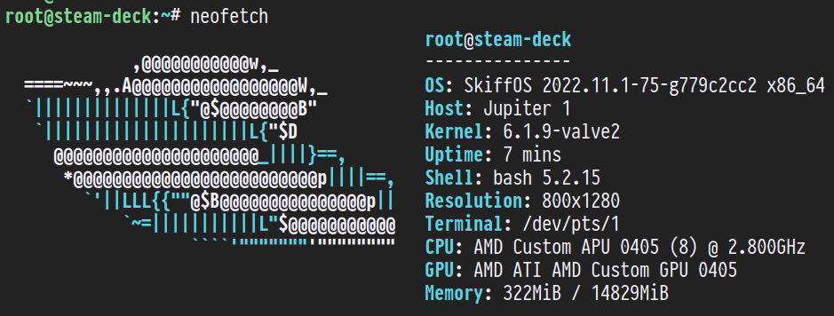

# SkiffOS on Steam Deck



The configuration package **valve/deck** is for the **Steam Deck** by Valve.

Reference:

 - https://en.wikipedia.org/wiki/Steam_Deck
 - https://help.steampowered.com/en/faqs/view/69E3-14AF-9764-4C28
 - https://github.com/mikeroyal/Steam-Deck-Guide
 - https://steamdeck-packages.steamos.cloud/archlinux-mirror/sources/jupiter-beta/

## Getting Started

Set the comma-separated `SKIFF_CONFIG` variable:

```sh
$ export SKIFF_CONFIG=valve/deck,core/holoiso
$ make configure                   # configure the system
$ make compile                     # build the system
```

Once the build is complete, we will flash to a MicroSD card to boot. You will
need to `sudo bash` for this on most systems.

```sh
$ sudo bash             # switch to root
$ export INTEL_DESKTOP_DISK=/dev/sdz # make sure this is right! (usually sdb)
$ make cmd/intel/desktop/format  # tell skiff to format the device
$ make cmd/intel/desktop/install # tell skiff to install the os
```

You only need to run the `format` step once. It will create the partition table.
The `install` step will overwrite the current Skiff installation on the card,
taking care to not touch any persistent data (from the persist partition). It's
safe to upgrade Skiff independently from your persistent data.

## Boot Process

To access the boot menu, power on the device while holding volume-down.

Use the d-pad to select "Boot menu."

Select the "EFI SD Card" to boot from the MicroSD.

## Overwriting SteamOS on NVME Drive

NOTE: these instructions may cause issues, proceed at your own risk!

You can install SkiffOS on the NVME drive once you have booted to the SD card.

 1. Boot SkiffOS on the SD card and ssh in.
 2. Enter the parted prompt with `parted /dev/nvme0n1`
 3. Wipe the drive with `mklabel gpt`.
 4. `mkpart primary fat32 1049kB 538MB`
 5. `name 1 EFI`
 6. `set 1 boot on`
 7. `mkpart primary ext4 538MB "100%"`
 8. `name 2 SKIFFOS`
 9. Type `quit` and press enter to exit parted.
 10. `partprobe /dev/nvme0n1`
 11. `mkfs.vfat -n EFI -F 32 /dev/nvme0n1p1`
 12. `mkfs.ext4 -F -L "SKIFFOS" /dev/nvme0n1p2`
 13. `mkdir -p /mnt/nvme/efi /mnt/nvme/persist /mnt/efi`
 14. `mount /dev/mmcblk0p1 /mnt/efi`
 15. `mount /dev/nvme0n1p1 /mnt/nvme/efi`
 16. `mount /dev/nvme0n1p2 /mnt/nvme/persist`
 17. `rsync -rav /mnt/efi/ /mnt/nvme/efi/`
 18. `rsync -rav /mnt/persist/boot/ /mnt/nvme/persist/boot/`
 19. Edit /mnt/nvme/persist/boot/refind_linux.conf and change `root=PARTUUID=...` to `root=/dev/nvme0n1p2`
 20. `sync`
 21. `reboot`

After rebooting, the system will reboot into SkiffOS from the NVME drive.

### Formatting the SD card

You can format the SD card as storage after connecting to your Deck:

1. Boot SkiffOS on the Steam Deck with the SD card removed.
2. SSH to the deck.
3. Insert the SD card.
4. Enter the parted prompt with `parted /dev/mmcblk0`
5. Wipe the SD card with `mklabel gpt`
6. `mkpart primary ext4 0% 100%`
7. `name 1 STORAGE`
8. Type `quit` and press enter to exit parted.
9. `partprobe /dev/mmcblk0`
10. `mkfs.ext4 -F -L "STORAGE" /dev/mmcblk0p1`

The MicroSD card can then be mounted: `mkdir -p /mnt/sd && mount /dev/mmcblk0p1 /mnt/sd`
